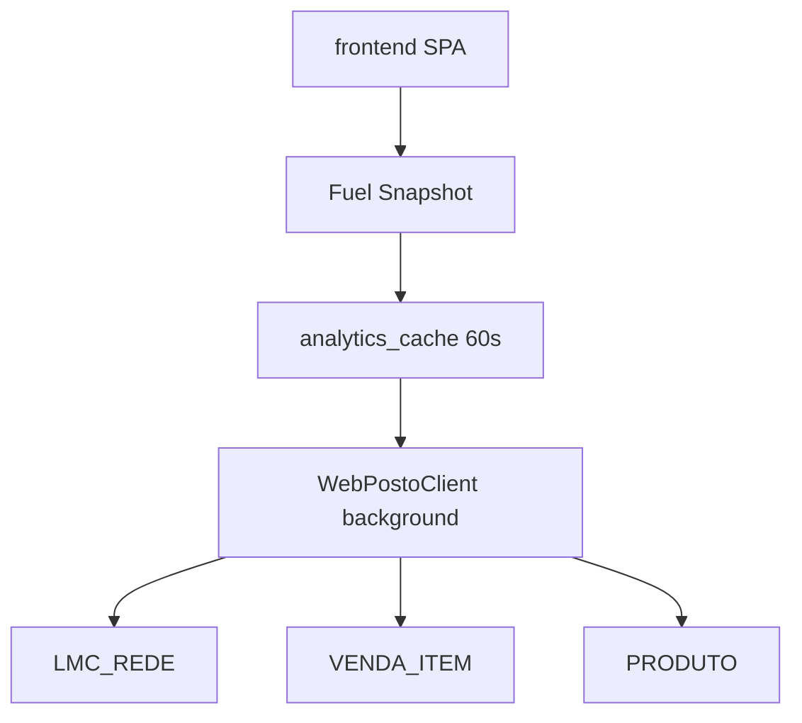

# FUEL ARCHITECTURE PLAN — LOGOS SPACE Combustíveis
## Sprint A02.5 | Agente 4 — Combustíveis

| Campo | Valor |
|---|---|
| **Cobertura atual** | 2/11 filiais (18%) |
| **Fonte física oficial** | `CONSULTAR_LMC_REDE` |
| **Fonte comercial oficial** | `VENDA_ITEM` |
| **Data** | 2026-06-08 |

---

## Fluxo Oficial (Golden Path)

### Dimensão Física — Litros LMC

```
GET /api/v1/fuel/executive
  → FuelAnalyticsService.get_fuel_summary()
  → CONSULTAR_LMC_REDE
  → FuelKpiEngine.build()
  → frontend: fuelExecutiveDashboard.js + executive card
```

### Dimensão Comercial — Litros Vendidos

```
GET /api/v1/sales/fuel-summary
  → AnalyticsService.get_fuel_summary()
  → VENDA_ITEM + ProdutoCatalog (is_active_fuel_product)
  → frontend: sales.js subtab fuels
```

### Suporte — Catálogo

```
GET /api/v1/products/catalog
  → ProdutoCatalogService (cache 24h)
  → PRODUTO + PRODUTO_EMPRESA
  → enrichFuelExecutive / enrichFuelSummary
```

---

## Fluxos Duplicados

| Componente | Conflito com oficial | Status | Ação |
|---|---|---|---|
| `AnalyticsService.get_fuel_summary` vs `FuelAnalyticsService` | LMC ≠ VENDA_ITEM (métricas diferentes, não duplicata) | **COEXISTIR** | Renomear rotas na UI |
| `vendas_combustivel_service` | Usa `analise_vendas_combustivel` (timeout) | **LEGADO** | Deprecar |
| `GET /v1/vendas-combustivel` | Mesmo endpoint instável | **LEGADO** | Deprecar |
| Snapshot fuel (executive) vs chamada direta fuels | Dupla fonte no executive | **PARCIAL** | Estender snapshot para fuels view |

---

## Fluxos Legados

| Componente | Motivo legado | Ação |
|---|---|---|
| `analise_vendas_combustivel` | Timeout em períodos longos | REMOVER |
| `produto_combustivel` | HTTP 401 no token | Usar ProdutoCatalog |
| `src/webposto/endpoints/combustivel.py` | SDK não integrado 8040 | REMOVER |
| Adelaide fuel metrics | Escopo VIP apenas | DEPRECAR no 8040 |

---

## Contrato UI — LMC vs Vendidos

| Dimensão | Label UI | Métricas | Endpoint |
|---|---|---|---|
| **Física** | Litros LMC (Saída) | litrosTotal, mix %, ranking filiais | `/fuel/executive` |
| **Comercial** | Litros Vendidos (PDV) | litros, faturamento R$, preço médio/L | `/sales/fuel-summary` |

**Regra:** nunca comparar números sem indicar a dimensão.

---

## Plano de Consolidação

| Fase | Sprint | Ação |
|---|---|---|
| 1 | A03 | Renomear `/sales/fuel-summary` → `/fuel/commercial` (alias mantido) |
| 2 | A03 | `FuelSnapshotService` — snapshot para view `fuels` |
| 3 | A04 | Extrair `FuelCommercialService` de AnalyticsService |
| 4 | A04 | Componente `FuelMetricsCard.js` unificado (mode: physical/commercial) |
| 5 | A05 | Deprecar `vendas_combustivel_service` e `/v1/vendas-combustivel` |
| 6 | E01 | Expandir cobertura token → 11 filiais |

---

## Diagrama Alvo



---

*Agente 4 — sem alteração de código nesta sprint.*
