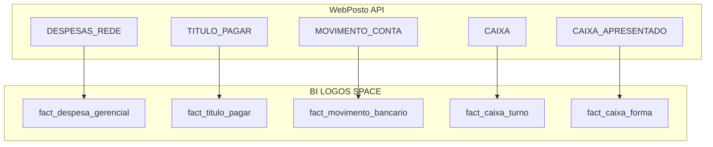

# LOGOS FINANCIAL MODEL 1.0

**Versão:** 1.0  
**Data:** 2026-06-08  
**Status:** Oficial LOGOS SPACE  
**Base:** Auditoria P0 / P0.1 / P0.2

---

## Princípio

O WebPosto expõe **fatos financeiros distintos** em endpoints diferentes.  
**Não deduplicar entre fontes.** Deduplicar apenas **dentro da mesma fonte**.

---

## Fatos oficiais (Data Warehouse)

### fact_despesa_gerencial

| Atributo | Valor |
|---|---|
| **Fonte API** | `/INTEGRACAO/CONSULTAR_DESPESAS_FINANCEIRO_REDE` |
| **Endpoint LOGOS** | `/v1/financial/expenses` |
| **Grain** | `empresaCodigo + data + planoContaGerencialCodigo + valor + descricaoDocumento` |
| **Campos** | `empresaCodigo`, `data`, `valor`, `planoConta`, `tipoDespesa`, `centroCusto` |

**Inclui:** salário, energia, compras lançadas como despesa, retirada, manutenção, plano gerencial.

**Fluxo backend (P0.2):** 1 fetch rede → filtro client-side por `empresaCodigo` / multiselect.

---

### fact_titulo_pagar

| Atributo | Valor |
|---|---|
| **Fonte API** | `/INTEGRACAO/TITULO_PAGAR` |
| **Endpoint LOGOS** | `/v1/financial/accounts-payable` |
| **Grain** | `tituloPagarCodigo` |
| **Uso** | Contas a pagar / fornecedores |

**Regra:** Não somar automaticamente com `fact_despesa_gerencial` sem regra de negócio e chave de ligação (API não expõe `tituloPagarCodigo` em despesas).

---

### fact_movimento_bancario

| Atributo | Valor |
|---|---|
| **Fonte API** | `/INTEGRACAO/MOVIMENTO_CONTA` |
| **Grain** | `movimentoContaCodigo` |
| **Inclui** | crédito, débito, tarifas, transferências, conciliação |

---

### fact_caixa_turno

| Atributo | Valor |
|---|---|
| **Fonte API** | `/INTEGRACAO/CAIXA` |
| **Grain** | `caixaCodigo` |
| **Inclui** | turno, `apurado`, `diferenca` (quebra) |

---

### fact_caixa_forma

| Atributo | Valor |
|---|---|
| **Fonte API** | `/INTEGRACAO/CAIXA_APRESENTADO` |
| **Grain** | `caixaCodigo + formaPagamento` |
| **Inclui** | `despesaApresentado/Apurado/Diferenca`, `valeFun*`, conciliação por forma |

---

### fact_titulo_receber

| Atributo | Valor |
|---|---|
| **Fonte API** | `/INTEGRACAO/TITULO_RECEBER` |
| **Grain** | `tituloReceberCodigo` |
| **Status LOGOS** | Stub — integrar em fase futura |

---

### fact_auditoria_exclusao

| Atributo | Valor |
|---|---|
| **Fonte API** | `/INTEGRACAO/FINANCEIRO_EXCLUSAO` |
| **Grain** | `codigo` (exclusão) |
| **Uso** | **Auditoria / risco / log** — **NÃO BI financeiro** |

**Alerta:** filtro de data aparentemente ignorado upstream — validar antes de produção.

---

## Dimensões

| Dimensão | Fonte |
|---|---|
| `dim_empresa` | `/INTEGRACAO/EMPRESAS` + Filial Master LOGOS |
| `dim_plano_conta` | derivado de despesas + movimento_conta |
| `dim_fornecedor` | TITULO_PAGAR |
| `dim_centro_custo` | despesas / movimento_conta |

---

## Classificação financeira LOGOS

| Classe | Fonte | BI principal |
|---|---|---|
| Despesa Gerencial | DESPESAS_REDE | Sim |
| Contas a Pagar | TITULO_PAGAR | Sim (módulo separado) |
| Caixa | CAIXA / CAIXA_APRESENTADO | Operacional / conciliação |
| Bancário | MOVIMENTO_CONTA | Fluxo / tarifas |
| Compras detalhadas | NOTA_ENTRADA / COMPRA_REDE | Bloqueado 401 — usar DESPESAS_REDE |
| Auditoria exclusão | FINANCEIRO_EXCLUSAO | Não |

---

## Diagrama

---

## Regras de integração

1. **DESPESAS_REDE:** uma chamada por período; filtro empresa no backend.
2. **Multiselect:** `empresa_codigos` restringe linhas — nunca retornar filiais fora da seleção.
3. **Dedupe:** apenas dentro de cada fact table.
4. **Snapshots:** agregam `fact_despesa_gerencial` — não substituem contagem linha a linha para auditoria.
5. **Executive KPIs despesas:** usar mesmo pipeline que `/v1/financial/expenses`.

---

## Histórico

| Versão | Data | Mudança |
|---|---|---|
| 1.0 | 2026-06-08 | Modelo oficial pós P0.1 + fix multiselect P0.2 |
