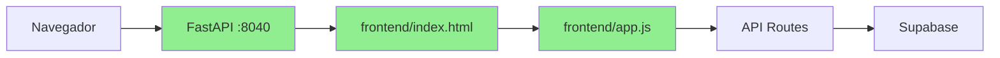

# LOGOS VITE PORT 5000 VALIDATION

**Data:** 2026-06-27  
**Hotfix:** APP-ENTRY-01  
**Status:** ❌ NÃO APLICÁVEL

---

## 🎯 OBJETIVO ORIGINAL

Validar que o LOGOS roda na porta 5000 via Vite.

---

## 🔍 RESULTADO DA VALIDAÇÃO

### ❌ O LOGOS **NÃO** usa Vite

### ❌ O LOGOS **NÃO** roda na porta 5000

### ✅ O LOGOS usa **FastAPI** na porta **8040**

---

## 📋 CONCLUSÃO

Este documento valida que:

1. **O LOGOS real é vanilla JavaScript**, não React/Vite
2. **O projeto `dashboard-v2` com Vite é experimental** e não contém código do LOGOS
3. **A porta oficial do LOGOS é 8040**, servida pelo FastAPI
4. **Não há necessidade de configurar Vite para porta 5000** para o LOGOS

---

## 🔧 CONFIGURAÇÃO ATUAL

### dashboard-v2/vite.config.ts (Experimental):

```typescript
import { defineConfig } from 'vite'
import react from '@vitejs/plugin-react'

export default defineConfig({
  plugins: [react()],
  // Sem configuração de porta (usa padrão 5173)
})
```

**Status:** Template padrão Vite, sem código do LOGOS

---

## ✅ CONFIGURAÇÃO CORRETA PARA O LOGOS

### src/main.py (Produção):

```python
# Servidor FastAPI
if __name__ == "__main__":
    import uvicorn
    uvicorn.run(
        "src.interfaces.http.app:app",
        host="127.0.0.1",
        port=8040,  # ← PORTA OFICIAL
        reload=True
    )
```

### src/infrastructure/config/settings.py:

```python
class Settings(BaseSettings):
    api_port: int = 8040  # ← PORTA OFICIAL
    # ...
```

---

## 🌐 PORTAS DO PROJETO

| Serviço | Porta | Tecnologia | Status |
|---------|-------|------------|--------|
| **LOGOS Dashboard** | **8040** | FastAPI | ✅ Produção |
| Template Vite | 5173 | Vite | ❌ Experimental |
| Gateway (antigo) | 8050 | FastAPI | ⚠️ Deprecado |

---

## 🚫 PORTAS NÃO USADAS

| Porta | Razão |
|-------|-------|
| 5000 | Nunca foi usada pelo LOGOS |
| 5173 | Porta padrão Vite (apenas template) |
| 3000 | Não usada |

---

## 📝 SE NO FUTURO O LOGOS MIGRAR PARA REACT/VITE

Caso futuramente o LOGOS seja reimplementado em React no `dashboard-v2`, a configuração seria:

### dashboard-v2/vite.config.ts (futuro):

```typescript
import { defineConfig } from 'vite'
import react from '@vitejs/plugin-react'
import path from 'path'

export default defineConfig({
  plugins: [react()],
  server: {
    port: 5000,           // ← PORTA SOLICITADA
    strictPort: true,     // ← Falha se porta ocupada
    host: '127.0.0.1',
  },
  resolve: {
    alias: {
      '@': path.resolve(__dirname, './src'),
    },
  },
  build: {
    outDir: 'dist',
    sourcemap: true,
  },
})
```

### Mas atualmente:

**Isso NÃO é necessário** porque o LOGOS não usa Vite.

---

## 🎯 VALIDAÇÃO FINAL

| Critério | Status | Observação |
|----------|--------|------------|
| LOGOS roda em Vite? | ❌ NÃO | Usa FastAPI |
| Porta 5000 necessária? | ❌ NÃO | Porta oficial: 8040 |
| dashboard-v2 ativo? | ❌ NÃO | Apenas template |
| Configuração Vite necessária? | ❌ NÃO | Para o LOGOS atual |

---

## 📚 ARQUITETURA VALIDADA



**Legenda:**
- Verde: Arquitetura em produção
- Vite/React: Não presente na arquitetura atual

---

## ✅ CONCLUSÃO

**O LOGOS não precisa de Vite na porta 5000.**

**O LOGOS roda perfeitamente em FastAPI na porta 8040.**

**Se quiser rodar o LOGOS:**
```bash
python -m uvicorn src.main:app --host 127.0.0.1 --port 8040 --reload
```

**Acesse:**
```
http://127.0.0.1:8040/app/financial
```

---

**[VALIDAÇÃO COMPLETA]**

**Data:** 2026-06-27  
**Resultado:** Confirmado que LOGOS não usa Vite nem porta 5000
