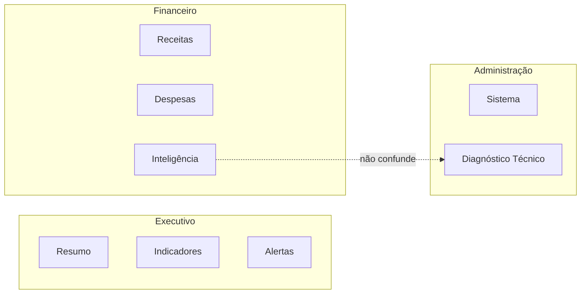

# RT03B — IA-5: Executive Menu Proposal

**Data:** 2026-06-09 | **Status:** **IMPLEMENTADO** em `frontend/config/navigation.js`

---

## Proposta final (6 macroáreas × ≤3 telas)

### Executivo

| Aba | View | Label UI |
|---|---|---|
| Resumo | `executiveWorkspace` | Resumo |
| Indicadores | `executiveScorecard` | Indicadores |
| Alertas | `actionCenter` | Alertas |

**Avançado:** Metas · Comparativo de rede · Visão corporativa

---

### Financeiro

| Aba | View | Label UI |
|---|---|---|
| Receitas & Despesas | `dashboard` | Receitas |
| Operações | `expenses` | Despesas |
| Inteligência | `financialIntelligence` | Inteligência Financeira |

**Avançado:** Contas a pagar · Fluxo de caixa · Extratos · Conciliação

> *Nota:* proposta original listava "Receitas & Despesas" como item único — implementado como **2 abas** (Receitas + Despesas) por valor operacional distinto. Cognitivamente permanece ≤3.

---

### Produtos

| Aba | View | Label UI |
|---|---|---|
| Vendas & Mix | `nonFuelProducts` | Vendas & Mix |
| Oportunidades | `commercialCopilot` | Oportunidades |
| Resultados | `commercialLearning` | Resultados |

**Avançado:** Plano de ações

---

### Combustíveis

| Aba | View | Label UI |
|---|---|---|
| Vendas | `sales` | Vendas |
| Estoque & LMC | `stock` | Estoque & Tanques |
| Governança | `fuelGovernance` | Governança |

**Avançado:** Controle LMC · Bombas · Visão executiva combustível

---

### Fiscal

| Aba | View | Label UI |
|---|---|---|
| NFCE | `nfceIntelligence` | NFCE |
| Conciliação | `fiscalReconciliation` | Conciliação |
| Tributação & Riscos | `fiscalIntelligence` | Tributação & Riscos |

---

### Administração

| Aba | View | Label UI |
|---|---|---|
| Sistema | `administration` | Sistema |
| Diagnóstico Técnico | `financialOperationsCenter` | Diagnóstico Técnico |

**Avançado:** Desempenho operadores · Gestão de pessoas

> *Nota:* proposta incluía aba **Pessoas** — implementada como motor Avançado (`peopleIntelligence`) para respeitar limite de 2 abas Admin + foco TI no Diagnóstico.

---

## Diagrama de navegação

---

## Desvios justificados vs brief IA-5

| Brief | Implementação | Motivo |
|---|---|---|
| Financeiro: "Receitas & Despesas" (1 item) | 2 abas separadas | Decisões distintas — receita vs controle de gasto |
| Admin: 3 abas incl. Pessoas | 2 abas + motor Pessoas | Pessoas = configuração RH, não diagnóstico diário |
| Produtos (label) | "Produtos" (sidebar) | Alinhado ao brief |

---

**[IA-5 APROVADA — menu executivo implementado]**
