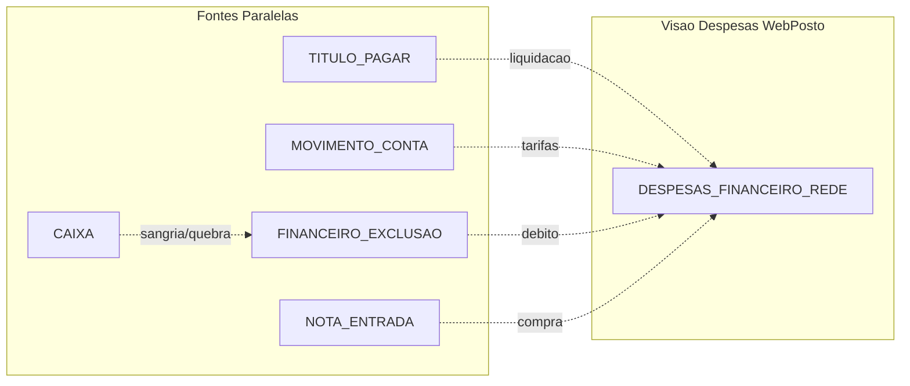

# WEBPOSTO_FINANCIAL_MODEL — Sprint P0.1

**Gerado:** 2026-06-08T13:13:31

## 1. O que o WebPosto considera despesa?

No modelo WebPosto, **despesa** na visão BI/financeiro consolidada = lançamentos de **plano de contas gerencial**
retornados por `CONSULTAR_DESPESAS_FINANCEIRO_REDE` (427 registros, R$ 135761.20 no período).

Campos expostos: `empresaCodigo`, `planoContaGerencialCodigo`, `descricaoDocumento`, `data`, `valor`.

Tipos identificados na descrição:

- Despesa operacional genérica: 363x (R$ 119117.95)
- Salário / folha: 27x (R$ 13711.00)
- Energia / utilities: 19x (R$ 186.00)
- Compra mercadoria / NF entrada: 15x (R$ 2116.75)
- Tarifa bancária: 2x (R$ 87.50)
- Sangria / retirada caixa: 1x (R$ 200.00)
- Compra combustível / TRR: 1x (R$ 399.00)

**Além disso**, o WebPosto trata como fluxo financeiro (não necessariamente na tela despesas):

- **Títulos a pagar** (`TITULO_PAGAR`) — contas a pagar / fornecedores
- **Movimentos bancários** (`MOVIMENTO_CONTA`) — extrato / tarifas / transferências
- **Caixa** (`CAIXA`, `CAIXA_APRESENTADO`) — turnos, diferenças, apuração
- **Exclusões** (`FINANCEIRO_EXCLUSAO`) — débitos caixa quando habilitado

## 2. O que não está vindo de DESPESAS_REDE?

- `MOVIMENTO_CONTA`: 400 registros (HTTP 200)
- `CONTA_REDE`: 17 registros (HTTP 200)
- `TITULO_PAGAR`: 66 registros (HTTP 200)
- `TITULO_RECEBER`: 11 registros (HTTP 200)
- `FINANCEIRO_EXCLUSAO`: 10203 registros (HTTP 200)
- `TRANSFERENCIA_BANCARIA`: 400 registros (HTTP 200)
- `CAIXA`: 21 registros (HTTP 200)
- `CAIXA_APRESENTADO`: 21 registros (HTTP 200)

Títulos a pagar **abertos/vencimento** vivem em `TITULO_PAGAR` — podem ou não estar liquidados em DESPESAS_REDE na data do pagamento.

## 3. Sangria aparece em qual endpoint?

| Fonte | Evidência | Registros período |
|---|---|---|
| **DESPESAS_REDE** | 1 lançamento com descrição "retirada das metralhas..." (R$ 200) | 1 |
| **CAIXA** | **Sem campos** `sangria`/`valorSangria` — apenas turno, `apurado`, `diferenca` | 21 turnos |
| **CAIXA_APRESENTADO** | Campos agregados `despesaApresentado/Apurado/Diferenca` por forma de pagamento | 21 |
| **FINANCEIRO_EXCLUSAO** | Log de **exclusões** (`MOVIMENTO_CONTA_DEBITO/CREDITO`) — **não é sangria operacional** | 10.203* |

\* **Alerta:** `FINANCEIRO_EXCLUSAO` retornou 10.203 registros mas amostra tem `dataExclusao=2026-04-08` — **filtro de data aparentemente ignorado**. Usar com paginação e validação antes de BI.

**Conclusão:** Sangria operacional no token atual aparece **consolidada em DESPESAS_REDE** (plano gerencial) ou agregada em **CAIXA_APRESENTADO.despesa*** — não há endpoint dedicado `SANGRIA_REDE`.

## Caixa — mapeamento de campos reais

| Conceito WebPosto | Endpoint | Campo API | No período |
|---|---|---|---|
| Quebra / diferença turno | `CAIXA` | `diferenca`, `apurado` | 21 turnos (ex.: diferença -R$ 50,66) |
| Conciliação por forma | `CAIXA_APRESENTADO` | `dinheiroDiferenca`, `cartaoDiferenca`, etc. | 21 |
| Despesa de caixa (agregada) | `CAIXA_APRESENTADO` | `despesaApresentado`, `despesaApurado`, `despesaDiferenca` | 21 |
| Vale funcionário caixa | `CAIXA_APRESENTADO` | `valeFunApresentado`, `valeFunApurado` | 21 |
| Sangria explícita | — | **Não exposto** no token | 0 |
| Suprimento / fundo | — | **Não exposto** no token | 0 |
| Troco | `VENDA` | `troco` (venda, não despesa) | N/A |

## 4. Compras aparecem em qual endpoint?

- **DESPESAS_REDE**: 15 registros com 'compra' na descrição (ex.: 'REF A COMPRA...')
- `COMPRA_REDE`: HTTP 401, 0 registros
- `NOTA_ENTRADA`: HTTP 401, 0 registros
- `PEDIDO_COMPRAS`: HTTP 401, 0 registros
- `CARTAO_COMPRA`: HTTP 400, 2 registros

## 5. Título a pagar aparece em qual endpoint?

- **`TITULO_PAGAR`**: HTTP 200, 66 registros, R$ 363452.16
- **`CONSULTAR_TITULO_PAGAR_REDE`**: rede vazia (0 registros) — usar TITULO_PAGAR individual
- **`CONTA` / CONTA_REDE**: fallback contas

## 6. Movimento bancário aparece em qual endpoint?

- **`MOVIMENTO_CONTA`**: HTTP 200, 400 registros
- Campos: `empresaCodigo, movimentoContaCodigo, valor, dataMovimento, descricao, tipoDocumentoOrigem, codigoTipoDocumentoOrigem, documentoOrigemCodigo, tipo, conciliado, evento, saldo`

## 7. Endpoints a integrar no LOGOS SPACE

| Prioridade | Endpoint | Motivo |
|---|---|---|
| P0 | DESPESAS_FINANCEIRO_REDE | Já integrado — corrigir filtro multiselect |
| P0 | TITULO_PAGAR | Contas a pagar — já integrado |
| P1 | MOVIMENTO_CONTA | Tarifas, conciliação, fluxo caixa banco |
| P1 | FINANCEIRO_EXCLUSAO | Auditoria exclusões — validar filtro data antes de BI |
| P2 | CAIXA + CAIXA_APRESENTADO | Conciliação turno / quebra |
| P2 | NOTA_ENTRADA / PEDIDO_COMPRAS | Compras detalhadas (se 200 OK) |
| P3 | TITULO_RECEBER | Contas a receber |

## 8. Modelo correto para Data Warehouse

```
fact_despesa_gerencial     ← CONSULTAR_DESPESAS_FINANCEIRO_REDE (grain: empresa+data+plano+valor)
fact_titulo_pagar          ← TITULO_PAGAR (grain: tituloPagarCodigo)
fact_movimento_bancario    ← MOVIMENTO_CONTA (grain: movimentoCodigo)
fact_caixa_turno           ← CAIXA (grain: caixaCodigo)
fact_caixa_conciliacao     ← CAIXA_APRESENTADO (grain: caixaCodigo+forma)
fact_financeiro_exclusao   ← FINANCEIRO_EXCLUSAO (grain: exclusaoCodigo)
fact_compra                ← NOTA_ENTRADA / PEDIDO_COMPRAS (se disponível)

dim_empresa                ← EMPRESAS
dim_plano_conta            ← derivado de despesas + movimento_conta
dim_fornecedor             ← TITULO_PAGAR
```

**Regra de ouro DW:** não deduplicar DESPESAS_REDE com TITULO_PAGAR sem chave de ligação — API não expõe `tituloPagarCodigo` em DESPESAS_REDE.

## Diagrama entidade-origem


